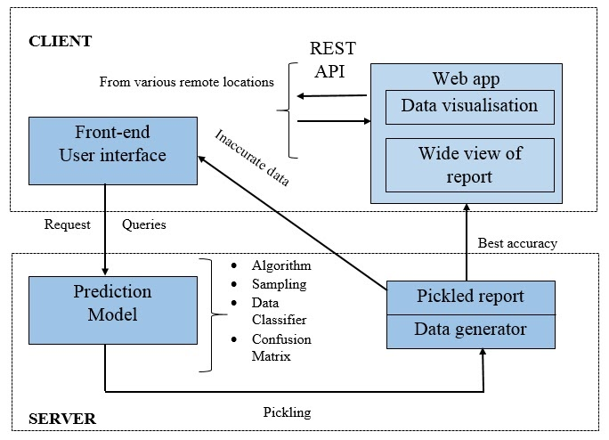

# ELAPSE - Airline Delays Prediction Portal

*Portal for prediction of Airline Delays and related parameters with a Dashboard for Data Visualization.
*Tech Stack : Python, Flask, React.js, Pandas, PostgreSQL

### System Architecture 

```

```

### Application Screenshots

```

```


